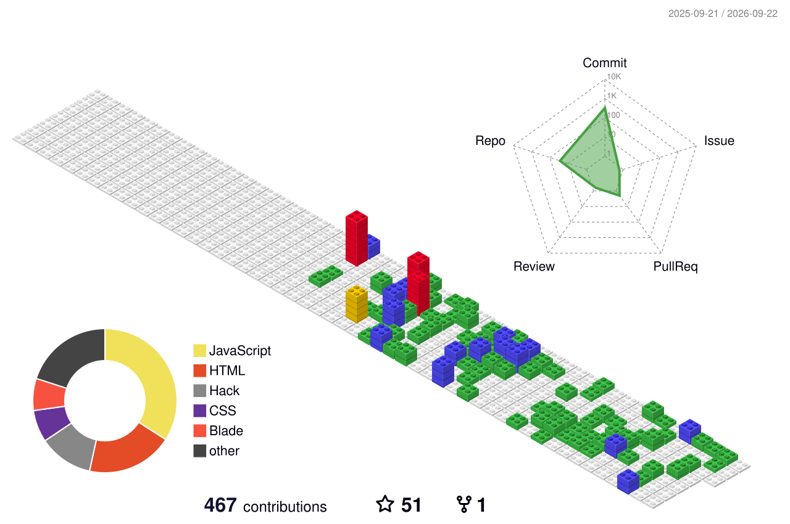

<div align="center">

<!-- ══════════════════════════════════════════════════════════════ -->
<!--                    ANIMATED HEADER BANNER                      -->
<!-- ══════════════════════════════════════════════════════════════ -->


<p align="center">
  
</p>

<br/>

<!-- Profile Views + Social Badges -->
<p>
  
  
  
</p>

</div>

---

<!-- ══════════════════════════════════════════════════════════════ -->
<!--                     ABOUT ME SECTION                           -->
<!-- ══════════════════════════════════════════════════════════════ -->


## 🧬 `whoami`

```typescript
const sachin = {
  name: "Sachin Immanuel Leo S",
  role: "Frontend Developer & UI Craftsman",
  location: "🇮🇳 Tamil Nadu, India",
  currentProject: "Leo Biling. 💸",
  learning: ["Full Stack Dev", "Vue.js", "Three.js"],
  passions: ["Pixel-Perfect UI", "Creative Design", "Open Source"],
  funFact: "Gets so caught up in pixel-perfect UI that forgets to blink 👁️",
  available: true,
};
```

<br clear="right"/>

---

<!-- ══════════════════════════════════════════════════════════════ -->
<!--                   ANIMATED ACTIVITY GRAPH                      -->
<!-- ══════════════════════════════════════════════════════════════ -->

## 📈 Activity Graph

[](https://github.com/ashutosh00710/github-readme-activity-graph)

---

<!-- ══════════════════════════════════════════════════════════════ -->
<!--                      SKILLS SECTION                            -->
<!-- ══════════════════════════════════════════════════════════════ -->

## 🛠️ Tech Arsenal

<div align="center">

### ⚡ Languages


### 🎨 Frontend & Frameworks


### 🗄️ Backend & Databases


### 🔧 Tools & Platforms


</div>

---

<!-- Gradient Badge Tech Stack -->
## 💎 Full Tech Stack with Expertise

<div align="center">

<!-- Languages -->


<!-- Frontend -->


<!-- Databases -->


<!-- CMS & Design -->


<!-- Tools -->


</div>


---

<!-- ══════════════════════════════════════════════════════════════ -->
<!--                   CONTRIBUTION SNAKE                           -->
<!-- ══════════════════════════════════════════════════════════════ -->

## 🐍 Contribution Snake

<div align="center">
  <picture>
    <source media="(prefers-color-scheme: dark)" srcset="https://raw.githubusercontent.com/sachinle/sachinle/output/github-contribution-grid-snake-dark.svg" />
    <source media="(prefers-color-scheme: light)" srcset="https://raw.githubusercontent.com/sachinle/sachinle/output/github-contribution-grid-snake.svg" />
    
  </picture>
</div>

---


<!-- ══════════════════════════════════════════════════════════════ -->
<!--                TOP CONTRIBUTED REPOSITORIES                    -->
<!-- ══════════════════════════════════════════════════════════════ -->

## 🔝 Top Contributed Repos

<div align="center">
  
</div>

---

<!-- ══════════════════════════════════════════════════════════════ -->
<!--                     CODING PLATFORMS                           -->
<!-- ══════════════════════════════════════════════════════════════ -->

## ⚔️ Coding Battlegrounds

<div align="center">

[](https://leetcode.com/sachinimmanuel2006/)

</div>

<div align="center">

[](https://www.hackerrank.com/sachinimmanuel21)
[](https://leetcode.com/sachinimmanuel2006/)

</div>

---

<!-- ══════════════════════════════════════════════════════════════ -->
<!--                     SKILLS PROGRESS BARS                       -->
<!-- ══════════════════════════════════════════════════════════════ -->

## 🎯 Proficiency Levels

```
Frontend Development   ████████████████████░   95% ⭐⭐⭐⭐⭐
UI/UX Design           ███████████████████░░   88% ⭐⭐⭐⭐⭐
JavaScript / ES6+      ████████████████████░   92% ⭐⭐⭐⭐⭐
Vue.js                 ████████████████░░░░░   78% ⭐⭐⭐⭐
React                  ███████████████░░░░░░   72% ⭐⭐⭐⭐
Three.js               ████████████░░░░░░░░░   60% ⭐⭐⭐
Python                 ██████████████░░░░░░░   68% ⭐⭐⭐⭐
Database Management    ████████████████░░░░░   78% ⭐⭐⭐⭐
WordPress / CMS        █████████████████░░░░   82% ⭐⭐⭐⭐
Full Stack (Growing)   ██████████████░░░░░░░   65% ⭐⭐⭐
```

---

<!-- ══════════════════════════════════════════════════════════════ -->
<!--                    WEEKLY DEV BREAKDOWN                        -->
<!-- ══════════════════════════════════════════════════════════════ -->

## ⏰ This Week's Dev Breakdown

<!--START_SECTION:waka-->
> 💡 Enable [WakaTime](https://wakatime.com) to auto-populate live coding stats here!

```text
Vue.js        ████████████░░░░░░░░░   48%
JavaScript    ████████░░░░░░░░░░░░░   32%
CSS           █████░░░░░░░░░░░░░░░░   18%
HTML          ██░░░░░░░░░░░░░░░░░░░    8%
Other         █░░░░░░░░░░░░░░░░░░░░    4%
```
<!--END_SECTION:waka-->

---

<!-- ══════════════════════════════════════════════════════════════ -->
<!--                     CONNECT SECTION                            -->
<!-- ══════════════════════════════════════════════════════════════ -->

## 🌐 Let's Connect & Collaborate

<div align="center">

[](https://sachinle.github.io/portfolio/)
[](https://linkedin.com/in/sachin-immanuel-leo-s-654244210)
[](mailto:sachinimmanuel2006@gmail.com)
[](https://fb.com/leo.rock.56829/)

</div>

---

<!-- ══════════════════════════════════════════════════════════════ -->
<!--                    RANDOM DEV QUOTE                            -->
<!-- ══════════════════════════════════════════════════════════════ -->

## ✍️ Dev Quote of the Day

<div align="center">


</div>

---

<!-- ══════════════════════════════════════════════════════════════ -->
<!--                     3D CONTRIBUTION                            -->
<!-- ══════════════════════════════════════════════════════════════ -->

## 🌍 3D Contribution Globe

<div align="center">

[](https://github.com/yoshi389111/github-profile-3d-contrib)

> 

</div>

---

<!-- ══════════════════════════════════════════════════════════════ -->
<!--                       FUN METRICS                              -->
<!-- ══════════════════════════════════════════════════════════════ -->

## 😂 A Little About Me in Numbers

```javascript
while (alive) {
  eat();
  sleep();
  code();
  designPixelPerfectUI(); // This takes 80% of the time 👁️
  repeat();
}
```

<div align="center">

| 🧠 Thinking About | 🔨 Building | 📖 Learning |
|:-:|:-:|:-:|
| Next pixel-perfect UI | MediCare Plus 🏥 | Three.js & WebGL 🌐 |
| Clean code architecture | Portfolio v2 💼 | Full Stack Dev 🛠️ |
| Open source contributions | Side projects 🚀 | Vue 3 Composition API ⚡ |

</div>

---

<!-- ══════════════════════════════════════════════════════════════ -->
<!--                        FOOTER WAVE                             -->
<!-- ══════════════════════════════════════════════════════════════ -->

<div align="center">

### 💜 Thanks for visiting! Drop a ⭐ if you like what you see!


[](https://visitcount.itsvg.in)

*Crafted with 💜 & endless cups of ☕ by Sachin Immanuel Leo S*

</div>
